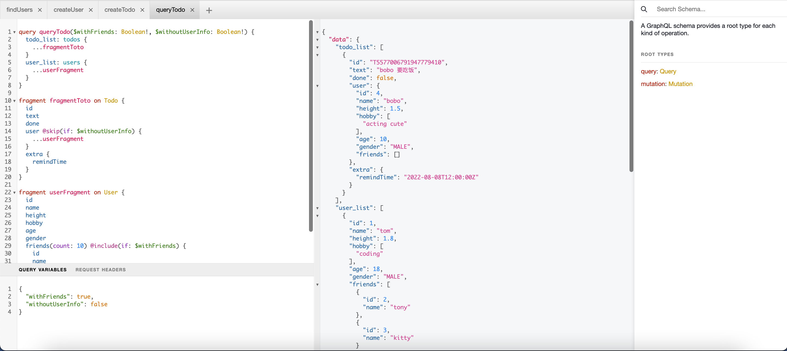

# GraphQL Example

## 项目介绍

1. 例子是一个备忘录接口，可以创建Todo，可以创建用户，并且可以查看用户关注的好友； 数据定义在[db.json](./file/db.json)中！

2. 这个框架可以通过编写graphql schema，帮你自动生成 resolver代码，只需要自己编写resolver即可！

3. [schema 定义](./graph/schema.graphql)

4. [query 查询例子](./file)

- [createTodo](./file/createTodo.md)
- [createUser](./file/createUser.md)
- [findUsers](./file/findUsers.md)
- [queryAll](./file/queryAll.md)

5. [resolver 编写](./graph/schema.resolvers.go)

## 目录结构

```shell
.
├── Makefile
├── README.md
├── file
│   ├── createTodo.md
│   ├── createUser.md
│   ├── db.json
│   ├── findUsers.md
│   └── queryAll.md
├── go.mod
├── go.sum
├── gqlgen.yml
├── graph
│   ├── generated
│   │   └── generated.go
│   ├── model
│   │   └── models_gen.go
│   ├── resolver.go
│   ├── schema.graphql
│   └── schema.resolvers.go ## 编写的resolver
├── server.go
├── tools.go
└── utils
    └── json.go

5 directories, 18 files
```
